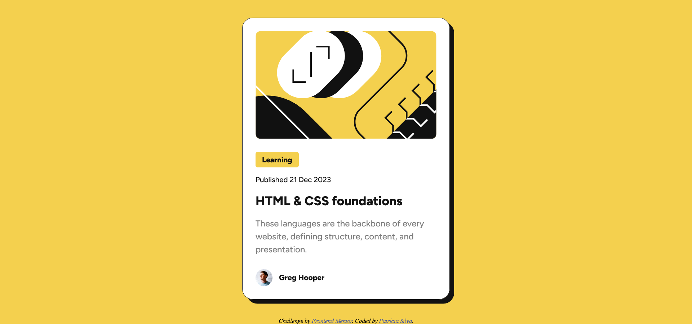

# Frontend Mentor - Blog preview card solution

This is a solution to the [Blog preview card challenge on Frontend Mentor](https://www.frontendmentor.io/challenges/blog-preview-card-ckPaj01IcS). Frontend Mentor challenges help you improve your coding skills by building realistic projects.

## Table of contents

- [Overview](#overview)
  - [The challenge](#the-challenge)
  - [Screenshot](#screenshot)
  - [Links](#links)
- [My process](#my-process)
  - [Built with](#built-with)
  - [What I learned](#what-i-learned)
    - [Static vs. variable fonts](#static-vs-variable-fonts)
    - [@font-face](#font-face)
    - [CSS custom properties](#css-custom-properties)
    - [rem units](#rem-units)
    - [clamp() CSS function](#clamp-css-function)
    - [LVHA-order](#lvha-order)
    - [Order CSS properties alphabetically](#order-css-properties-alphabetically)
  - [Useful resources](#useful-resources)
- [Author](#author)

## Overview

### The challenge

Users should be able to:

- See hover and focus states for all interactive elements on the page.

### Screenshot



### Links

- [Solution](https://github.com/patriciarrs/Frontend-Mentor-Blog-Preview-Card)
- [Live Site](https://patriciarrs.github.io/Frontend-Mentor-Blog-Preview-Card/)

## My process

### Built with

- Semantic HTML5 markup
- CSS custom properties
- Flexbox

### What I learned

#### Static vs. variable fonts

I learned the difference between static and variable fonts.
I decided to use variable fonts because of their advantages (mainly using only one file and a smaller file size).

#### @font-face

I used the `@font-face` CSS at-rule to specify the custom font to display text (loaded from the repo).

#### CSS custom properties

I used CSS custom properties (CSS variables or cascading variables) to represent the color values to be reused throughout the stylesheets.
Example:

```css
:root {
  --black: hsl(0, 0%, 7%);
  --grey: hsl(0, 0%, 50%);
  --white: hsl(0, 0%, 100%);
  --yellow: hsl(47, 88%, 63%);
}

.body {
  color: var(--black);
}
```

#### rem units

I used `rem` (root `em`) instead of `px` (pixels) since it has several advantages related to responsiveness (different screen sizes and zooming), accessibility (respecting users' browser's settings), and maintainability (single point of control and consistency).

```css
html {
  font-size: 62.5%;
}
```

Setting the `html` `font-size` to 62.5% translates the base `font-size` to 10px if the browser's default font size is 16px (which it usually is). This makes it easier to calculate `rem` values, as 1 rem will equal 10px.

#### clamp() CSS function

To reduce font size for smaller screens without using media queries, I used the `clamp()` CSS function.
The `clamp()` CSS function clamps a middle value within a range of values between a defined minimum bound and a maximum bound.
The function takes three parameters: a minimum value, a preferred value, and a maximum allowed value.
Example:

```css
/* clamp(min, val, max) */
font-size: clamp(1.2rem, 1.1296rem + 0.1878vw, 1.4rem);
```

#### LVHA-order

Styles defined by link-related pseudo-classes can be overridden by any subsequent styles that have at least equal specificity.
To style links appropriately, we should use the LVHA-order: :link — :visited — :hover — :active.

#### Order CSS properties alphabetically

I wanted to have my CSS properties ordered alphabetically on file save.
I achieved that with the [stylelint-order](https://github.com/hudochenkov/stylelint-order) plugin for [Stylelint](https://stylelint.io/) by using the rule `properties-alphabetical-order`.

### Useful resources

- [Variable Fonts vs. Static Fonts](https://www.monotype.com/resources/expertise/variable-fonts-101) - This helped me understand the difference between static and variable fonts.
- [@font-face](https://developer.mozilla.org/en-US/docs/Web/CSS/@font-face) - This helped me remember how to use the `@font-face` CSS at-rule to specify a custom font.
- [Using CSS custom properties (variables)](https://developer.mozilla.org/en-US/docs/Web/CSS/Using_CSS_custom_properties) - This is an article that explains how to use CSS custom properties.
- [line-height](https://developer.mozilla.org/en-US/docs/Web/CSS/line-height) - This helped me remember that the preferred way to set line-height is to use a unitless number for the value.
- [CSS Clamp(): The Responsive Combination We’ve All Been Waiting For](https://blog.bitsrc.io/css-clamp-the-responsive-combination-weve-all-been-waiting-for-f1ce1981ea6e) - This is an amazing article which helped me finally understand `clamp()`. I'd recommend it to anyone still learning this concept.
- [clamp() Calculator](https://chrisburnell.com/clamp-calculator/?font-size-root=10&size-min=14&size-max=16&viewport-min=320&viewport-max=1280&viewport-units=vw) - This article includes a calculator where we can plug in the min and max font-sizes. It will compute the preferred font-size value.

## Author

- Frontend Mentor - [@patriciarrs](https://www.frontendmentor.io/profile/patriciarrs)
